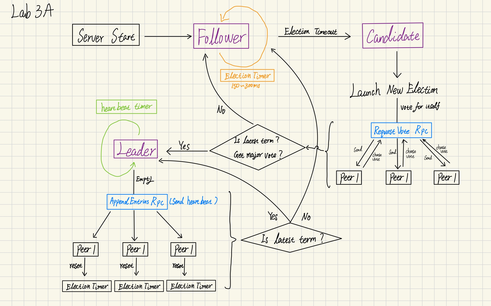

# Lab 3 Raft

## 3A: leader election

Code change please see [here](https://github.com/mwfj/6.5840-Distributed-Systems/pull/6/files)




## 3B: Log Implement

Code Change please see:

1. [Main code change](https://github.com/mwfj/6.5840-Distributed-Systems/pull/7/files)
2. [Make code more robust](https://github.com/mwfj/6.5840-Distributed-Systems/pull/8/files)
3. [Optimize with more efficient algorithm](https://github.com/mwfj/6.5840-Distributed-Systems/pull/9)

In this part the mainly change is to add two important components:

- ***Applier***: each server use is to save new log created entries into local
- ***Replicator*：** Leader use replicator to trigger that sending new created log entries to followers via `AppendEntry RPC`
  - From the leader perspective, each follower has its own replicator

**Leader trigger the *replicator* for each follower to send the new create log entry to receiver.**

**Follower receive the new create log entries from Leader and save it into local triggering this process by *applier*.** 


## 3C: persistence

Implement in-memory persistence, where it save/restore persistent state from a `Persister` object.

Code Change please see: [here](https://github.com/mwfj/6.5840-Distributed-Systems/pull/10/files)


## 3D: log compaction

Code Change please see: [here](https://github.com/mwfj/6.5840-Distributed-Systems/pull/11/files)

Implement Snapshot(Log compact) in Raft.

1. Each node periodically snapshot raft state(both of Leader and Follower)
2. Leader send its snapshot to follower via `InstallSnapshot RPC` if the Follower's log is behind.

**Key Interactions:**

1. Service → Raft: Snapshot(index, data) - Compact logs up to index
2. Leader → Follower: `InstallSnapshot RPC` - Send snapshot when follower is behind
3. Follower → Service: `ApplyMsg` with snapshot - Notify service of new snapshot through `applyCh`
4. All Nodes: **Persist snapshot** + **truncated logs** for crash recovery

**CRITICAL POINTS:**

- Snapshots allow log compaction while preserving safety
- `InstallSnapshot RPC` handles network partitions and slow followers
- Careful conflict resolution maintains log consistency
- Persistence before RPC reply ensures crash safety


## Test Result

### **Lab 3A**

```shell
go test --race -run 3A
Test (3A): initial election ...
  ... Passed --   3.0  3  116   34628    0
Test (3A): election after network failure ...
  ... Passed --   4.4  3  238   51401    0
Test (3A): multiple elections ...
  ... Passed --   5.5  7 1104  238375    0
PASS
ok      6.5840/raft     13.887s
```

### **Lab 3B**

```shell
go test --race -run 3B
Test (3B): basic agreement ...
  ... Passed --   0.3  3   16    4694    3
Test (3B): RPC byte count ...
  ... Passed --   0.7  3   48  115042   11
Test (3B): test progressive failure of followers ...
  ... Passed --   4.3  3  218   49730    3
Test (3B): test failure of leaders ...
  ... Passed --   4.4  3  341   81580    3
Test (3B): agreement after follower reconnects ...
  ... Passed --   3.3  3  142   39636    7
Test (3B): no agreement if too many followers disconnect ...
  ... Passed --   3.2  5  374   82001    3
Test (3B): concurrent Start()s ...
  ... Passed --   0.6  3   19    5633    6
Test (3B): rejoin of partitioned leader ...
  ... Passed --   3.6  3  254   65623    4
Test (3B): leader backs up quickly over incorrect follower logs ...
  ... Passed --   9.7  5 1796 1625437  102
Test (3B): RPC counts aren't too high ...
  ... Passed --   2.1  3   80   24622   12
PASS
ok      6.5840/raft     33.218s
```


### **Lab 3C**

```shell
go test --race -run 3C
Test (3C): basic persistence ...
  ... Passed --   2.7  3  118   30962    6
Test (3C): more persistence ...
  ... Passed --  13.4  5 1535  331342   16
Test (3C): partitioned leader and one follower crash, leader restarts ...
  ... Passed --   1.2  3   50   12786    4
Test (3C): Figure 8 ...
  ... Passed --  29.3  5 2316  528201   76
Test (3C): unreliable agreement ...
  ... Passed --   1.6  5  432  147118  246
Test (3C): Figure 8 (unreliable) ...
  ... Passed --  33.6  5 5855 12622105  385
Test (3C): churn ...
  ... Passed --  16.1  5 7729 3320631 2241
Test (3C): unreliable churn ...
  ... Passed --  16.1  5 3200 3375366  965
PASS
ok      6.5840/raft     115.140s
```


### **Lab 3D**

```shell
go test --race -run 3D
Test (3D): snapshots basic ...
  ... Passed --   2.2  3  196   68241  234
Test (3D): install snapshots (disconnect) ...
  ... Passed --  39.4  3 1772  650229  332
Test (3D): install snapshots (disconnect+unreliable) ...
  ... Passed --  53.4  3 2384  826120  332
Test (3D): install snapshots (crash) ...
  ... Passed --  24.5  3 1087  453262  345
Test (3D): install snapshots (unreliable+crash) ...
  ... Passed --  27.8  3 1214  521203  337
Test (3D): crash and restart all servers ...
  ... Passed --   4.2  3  290   80780   59
Test (3D): snapshot initialization after crash ...
  ... Passed --   1.5  3   80   21226   14
PASS
ok      6.5840/raft     153.941s
```

